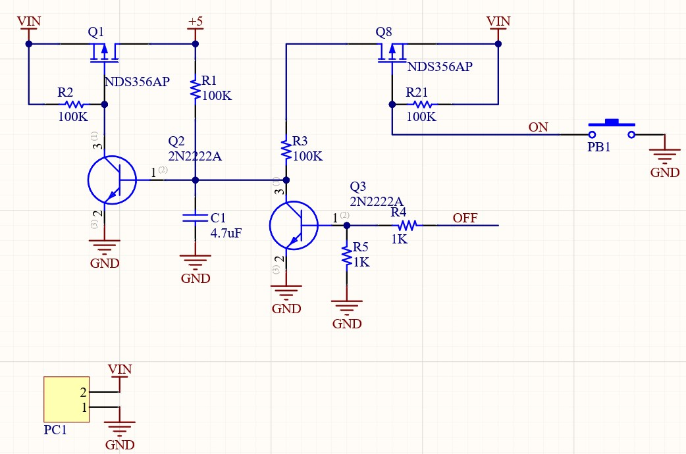

# Room Temperature and Humidity Display
In this project, I used mostly the spare parts that I found in my drawer from previous projects. I wanted to measure and show the humidity of my bedroom. I had an SHT20 temperature and humidity sensor with I2C communication bus. To extract this sensor data, I found an old Atmega64L and 2 common anode 7-segment displays. So I designed a PCB using these parts. For driving the 7-segment cathodes, I used a ULN2003 Darlington array IC. In the picture below the top 7 segments show the humidity and the bottom one shows the temperature. As the smart home and IoT devices are growing rapidly, I decided to put an ESP8266 on the PCB for future uses. The ESP8266 communicates over UART with the Atmega64.

I managed to put most of the electronics on the bottom side so that only the sensor and the 7-segment displays would be seen on the top side. Here is a look at the bottom of the PCB.

I wanted to supply the board with some batteries, so I placed a latch-switch circuit with on and off triggers. The board is turned on with a button connected to the on trigger and the off trigger is produced by the MCU to cut off the circuit supply after a short period to save battery power. The latch circuit is shown below.

The project is written in the Atmel Studio IDE. The Atmega64 communicates over the I2C bus with the sensor and all of the data are refreshed in a timer interrupt. In the interrupt, a variable counts the seconds that the MCU has been on and after 8 seconds, the power supply is cut off. Between the communication with the sensor, the microcontroller is put in sleep mode to save power and woken up with a timer interrupt. 